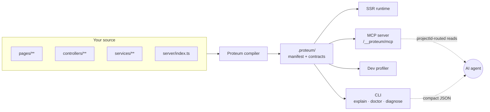

<!-- Logo: drop a square mark at docs/assets/logo.png and uncomment the line below. -->
<!-- <p align="center"></p> -->

<h1 align="center">Proteum</h1>

<p align="center">
  <strong>The explicit, agent-native full-stack TypeScript framework.</strong><br />
  Server-first SSR &amp; SEO, zero runtime magic, and a codebase your AI agents can read without reverse-engineering.
</p>

<p align="center">
  <a href="https://www.npmjs.com/package/proteum"></a>
  <a href="https://www.npmjs.com/package/proteum"></a>
  <a href="#-requirements"></a>
  <a href="./package.json"></a>
  <a href="#-built-for-ai-agents"></a>
  <a href="./LICENSE"></a>
</p>

<p align="center">
  <a href="#-quick-start">Quick Start</a> ·
  <a href="#-core-concepts">Concepts</a> ·
  <a href="#-built-for-ai-agents">AI Agents</a> ·
  <a href="#-the-cli">CLI</a> ·
  <a href="#-documentation">Docs</a> ·
  <a href="#-philosophy">Philosophy</a>
</p>

---

## What is Proteum?

Most full-stack frameworks optimize first for human convenience and lean on ambient runtime magic to get there. **Proteum optimizes for explicitness** — typed, machine-readable contracts that stay legible to humans *and* to the AI agents that increasingly maintain real codebases.

Every route, controller, service, and layout is an exported **definition object**. The compiler reads them and emits deterministic contracts into `.proteum/`, so the framework can *tell you* what it discovered instead of asking you to guess. That same manifest powers the CLI, the dev profiler, and a built-in **Model Context Protocol** server — so an agent can answer "which controller handles this request, and why is it slow?" in a single low-token call.

```bash
npx proteum init my-app --name "My App"
```

## ✨ Highlights

- **🧩 Explicit by design** — routes, controllers, services, and the app graph are typed definition objects, not decorators or filename conventions hiding behind a compiler.
- **⚡ Server-first SSR** — fast Preact / React 19 server rendering with a minimal client runtime and an islands model for interactivity exactly where you need it.
- **🔎 SEO as a primitive** — typed app identity, metadata, JSON-LD, and canonical URLs are part of the application contract, not a plugin you bolt on later.
- **🧠 Built for AI agents** — a machine-scope MCP router, compact JSON diagnostics, and generated manifests give LLMs a reliable map of your app. [Jump to details ↓](#-built-for-ai-agents)
- **📈 Live observability** — built-in request tracing, performance roll-ups, and an interactive dev profiler with charts over the same contracts the CLI reads.
- **🛡️ Validation at the edge** — declare action input once with `defineAction({ input, handler })`; handlers receive parsed, typed input.
- **🗄️ Prisma-first data layer** — typed Prisma 7 models (MySQL / MariaDB / Postgres) on `this.models`, with tagged-template SQL as an escape hatch when you need it.
- **🔗 Monorepo & connected apps** — compose multiple apps with typed cross-app controller contracts.
- **🚀 Production builds** — an `rspack` + Tailwind 4 pipeline with bundle analysis baked in.

## 📋 Requirements

| Runtime | Version      |
| ------- | ------------ |
| Node.js | `>= 20.19.0` |
| npm     | `>= 3.10.10` |

## 🚀 Quick Start

```bash
# Scaffold a new app from deterministic built-in templates
npx proteum init my-app --name "My App"
cd my-app

# Install and wire up agent instructions (AGENTS.md / CLAUDE.md)
npm install
npx proteum configure agents

# Start the compiler, SSR server, and hot-reload loop
npx proteum dev
```

Then the everyday loop:

```bash
npx proteum check          # refresh contracts, typecheck, and lint in one pass
npx proteum build --prod   # production server + client bundles into bin/
node ./bin/server.js       # run it
```

A typical app `package.json`:

```json
{
  "scripts": {
    "dev": "proteum dev",
    "check": "proteum check",
    "build": "proteum build --prod",
    "start": "node ./bin/server.js"
  }
}
```

## 🧱 Core Concepts

Everything you author is an explicit, typed definition object. Here is the whole surface in four snippets.

### Pages — server-first SSR

```tsx
import { definePageRoute } from '@common/router/definitions';

export default definePageRoute({
  path: '/',
  options: { auth: false, layout: false },
  // Runs on the server. Every returned key becomes page data.
  data: ({ Plans, Stats }) => ({
    plans: Plans.getPlans(),
    stats: Stats.general(),
  }),
  render: ({ plans, stats }) => <LandingPage plans={plans} stats={stats} />,
});
```

`path` and `options` (`auth`, `layout`, `static`, `redirectLogged`, …) are static and compiler-readable. Runtime references are allowed only inside `data` and `render`.

### Controllers — typed request entrypoints

```ts
import { defineAction, defineController, schema } from '@generated/server/controller';

export default defineController({
  path: 'Auth',
  actions: {
    loginWithPassword: defineAction({
      input: schema.object({
        email: schema.string().email(),
        password: schema.string().min(8),
      }),
      handler: ({ input, services, request }) =>
        services.Auth.loginWithPassword(input, request),
    }),
  },
});
```

Validation lives next to the handler. Business logic is reached through `services`, `models`, or `app` — never ambient globals.

### Services — business logic, request-free

```ts
import Service from '@server/app/service';

export default class StatsService extends Service<Config, {}, MyApp, MyApp> {
  public async general() {
    return {
      // Prisma first: typed model access on this.models
      totalDomains: await this.models.domain.count(),
      tlds: Object.keys(this.app.Domains.tlds).length,
      // Need raw SQL? It's right there as an escape hatch:
      // await this.models.SQL`SELECT COUNT(*) FROM domains`.value()
    };
  }
}
```

### Application — the explicit composition root

```ts
// server/index.ts — the canonical type root for services, router, models, and commands
import { defineApplication } from '@server/app';

export default defineApplication({
  services: createServices, // (app) => ({ Users: new Users(...) })
  router: createRouter,      // (app) => new Router(...)
});
```

Proteum reads `server/index.ts` as the single source of truth for installed root services and router plugins — there is no hidden registry.

## 🧠 Built for AI Agents

This is where Proteum is different. The compiler emits a machine-readable description of your app into `.proteum/`, and **every tool reads the same snapshot** — the CLI, the dev-only HTTP endpoints, the profiler, and a Model Context Protocol server.



An agent — or you — can ask the framework directly:

| Question | Command |
| --- | --- |
| Which controller owns this request? | `proteum explain owner /api/Auth/CurrentUser` |
| What did the framework detect? | `proteum doctor --json` |
| Why is this route failing? | `proteum diagnose /dashboard` |
| Where is the time going? | `proteum perf request /dashboard` |
| What happened in the last request? | `proteum trace latest` |

**Why agents work well here:**

- **One MCP entry point.** `proteum mcp` runs a machine-scope router; `proteum dev` exposes each app at `/__proteum/mcp`. An agent calls `workflow_start`, gets a stable `projectId`, and routes every follow-up read to the right app.
- **Token-efficient output.** Diagnostics default to compact `proteum-agent-v1` JSON — decision-ready summaries first, raw detail only behind `--full`, `--manifest`, or `--events`.
- **Generated instruction files.** `proteum configure agents` writes managed `AGENTS.md` / `CLAUDE.md` instruction routers, kept in sync on every `proteum dev` start.
- **Auth without UI automation.** `proteum session <email> --role ADMIN` mints a dev session (token + Playwright-ready cookie) so agents and E2E suites skip the login flow.

> Full agent contract: [docs/mcp.md](docs/mcp.md), [docs/diagnostics.md](docs/diagnostics.md), and [docs/agent-routing.md](docs/agent-routing.md).

## 📊 Diagnostics & Observability

Proteum ships one request-instrumentation system with two shapes: a retained **dev trace** buffer and a reduced request-local **profiling** snapshot.

- **`proteum trace`** — live, in-memory traces for auth, routing, controller, context, SSR, API, Prisma SQL, and render, with sensitive fields redacted and payloads summarized.
- **`proteum perf`** — aggregates those same traces into hot paths, one-request waterfalls, regression comparisons, and memory-drift views.
- **Dev profiler** — the panel during `proteum dev` renders `Summary`, `Auth`, `Routing`, `Controller`, `SSR`, `API`, `SQL`, `Errors`, `Perf`, and more as visual charts over the same live contracts.

```bash
proteum trace arm --capture deep        # force the next request into deep capture
proteum perf top --since today          # rank the hottest traced paths
proteum perf compare --baseline yesterday --target today --group-by route
```

> Full guide: [docs/request-tracing.md](docs/request-tracing.md).

## 🛠️ The CLI

A compact CLI focused on the real app lifecycle.

| Command | Purpose |
| --- | --- |
| `proteum dev` | Compiler + SSR server + hot-reload loop, with a live profiler |
| `proteum build --prod` | Production server & client bundles into `bin/` (`--analyze` for bundle reports) |
| `proteum refresh` | Regenerate `.proteum` contracts and typings |
| `proteum check` | Refresh, typecheck, and lint in one command |
| `proteum create` | Scaffold a page, controller, command, route, or service |
| `proteum init` | Scaffold a new app from deterministic templates |
| `proteum explain` | Inspect routes, controllers, services, layouts, env, and connected projects |
| `proteum doctor` | Inspect manifest diagnostics |
| `proteum diagnose` | Owner + diagnostics + traces + logs for one route or request |
| `proteum perf` / `proteum trace` | Performance roll-ups and live request traces |
| `proteum mcp` | Machine-scope MCP router for live app reads |
| `proteum connect` | Inspect connected-project sources, env, and imported controllers |
| `proteum session` / `proteum e2e` | Dev auth bootstrap and Playwright runs without shell env juggling |
| `proteum verify` | Targeted change checks or the full reference-app pass |

Run `proteum --help` or `proteum help <command>` for the full reference.

## 🏗️ Project Structure

```text
my-app/
├─ identity.config.ts      # typed app identity, locale, and SEO defaults
├─ proteum.config.ts       # compiler + connected-project settings
├─ client/
│  ├─ pages/               # SSR page entrypoints (definePageRoute)
│  ├─ islands/             # interactive client islands
│  ├─ components/
│  └─ services/
├─ server/
│  ├─ index.ts             # defineApplication — the app graph
│  ├─ controllers/         # defineController + defineAction
│  ├─ services/            # business logic (extends Service)
│  └─ config/
├─ common/                 # shared router contracts, models, errors
├─ commands/               # dev-only internal commands
└─ .proteum/               # framework-owned generated contracts (do not edit)
```

## 📚 Documentation

| Topic | Guide |
| --- | --- |
| Diagnostics & explainability | [docs/diagnostics.md](docs/diagnostics.md) |
| Model Context Protocol (MCP) | [docs/mcp.md](docs/mcp.md) |
| Request tracing & perf | [docs/request-tracing.md](docs/request-tracing.md) |
| Agent routing & token efficiency | [docs/agent-routing.md](docs/agent-routing.md) |
| Dev commands | [docs/dev-commands.md](docs/dev-commands.md) |
| Dev sessions | [docs/dev-sessions.md](docs/dev-sessions.md) |
| Migrating to 2.5 | [docs/migration-2.5.md](docs/migration-2.5.md) |

## 🧭 Philosophy

Proteum is opinionated on purpose. It intentionally **avoids** the patterns that make frameworks hard to inspect and hard to trust:

- ❌ hidden runtime globals
- ❌ implicit service registration behind bootstrap helpers
- ❌ request state smuggled into business services
- ❌ validation defined far from its handler
- ❌ routing you cannot explain without reading the compiler
- ❌ generated code that hides where it came from

In their place: explicit definition objects, a single canonical app graph, validation at the edge, and deterministic generation you can read, diff, and trace back to source.

## 🧰 Built With

[TypeScript](https://www.typescriptlang.org/) · [Preact](https://preactjs.com/) / [React 19](https://react.dev/) · [Express](https://expressjs.com/) · [Prisma 7](https://www.prisma.io/) · [rspack](https://rspack.dev/) · [Tailwind CSS 4](https://tailwindcss.com/) · [Zod](https://zod.dev/) · [Ink](https://github.com/vadimdemedes/ink) · [Model Context Protocol](https://modelcontextprotocol.io/)

## 🤝 Contributing

Issues and pull requests are welcome. Proteum is actively hardening its explicit model, and the direction is deliberate: fewer ways to do the same thing, more contracts the framework can explain on its own.

When proposing a change, start from a concrete mismatch or risk visible in a real app, show the target API with realistic client/server usage, and keep generated code deterministic and auditable.

## 💜 Sponsors

Proteum is proudly sponsored by **[Unique Domains](https://unique.domains/?utm_source=github&utm_medium=referral&utm_campaign=repo_proteum&utm_content=top_sponsor)**.

<p>
  <a href="https://unique.domains/?utm_source=github&utm_medium=referral&utm_campaign=repo_proteum&utm_content=top_sponsor">
    
  </a>
</p>

## 📄 License

[MIT](./LICENSE) © [Gaetan Le Gac](https://github.com/gaetanlegac)
